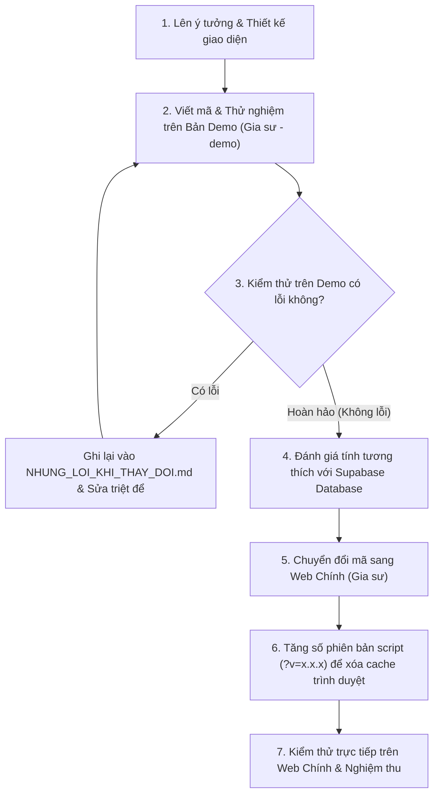

# CHI TIẾT CÁCH THAY ĐỔI & SO SÁNH GIỮA BẢN DEMO VÀ WEB CHÍNH

Tài liệu này cung cấp hướng dẫn kỹ thuật chi tiết về cách thực hiện các thay đổi trên mã nguồn, chỉ rõ sự khác biệt giữa **Bản Demo** (chạy dữ liệu giả lập `sessionStorage`) và **Web Chính** (kết nối Supabase REST API).

---

## 1. So sánh kiến trúc: Bản Demo vs Web Chính

| Thành phần | Bản Demo (`Gia sư - demo`) | Web Chính (`Gia sư`) |
| :--- | :--- | :--- |
| **Cơ sở dữ liệu** | `sessionStorage` (khởi tạo từ `js/demo-data.js`) | Supabase PostgreSQL (REST API: `gs_students`, `gs_tutors`,...) |
| **Backend Gateway** | `MockGoogleScriptRunInstance` trong `js/api.js` | `GoogleScriptRunInstance` gọi `supaGet`, `supaPatch`, `supaPost` |
| **Xử lý lưu trữ file** | Base64 lưu trực tiếp trong bộ nhớ trình duyệt | Google Apps Script Drive Upload hoặc Base64/URL |
| **Tốc độ phản hồi** | Tức thì (Client-side) | Phụ thuộc vào mạng & Supabase API |
| **Mục đích sử dụng** | Thử nghiệm tính năng mới, kiểm thử giao diện UX/UI | Hệ thống hoạt động thực tế phục vụ người dùng thật |

---

## 2. Chi tiết kỹ thuật từng hạng mục thay đổi

### 2.1. Định dạng học phí tự động có dấu chấm (`200.000`)

#### A. Thay đổi trên Giao diện (HTML)
Thay đổi các thẻ `<input type="number">` sang `<input type="text">` có hỗ trợ bàn phím số di động và sự kiện `oninput`:
* **Vị trí 1:** Ô nhập học phí thêm học sinh (`addStudentTuition`) trong `tutor-dashboard.html`:
  ```html
  <input type="text" inputmode="numeric" id="addStudentTuition" placeholder="Ví dụ: 200.000" oninput="formatCurrencyInput(this)">
  ```
* **Vị trí 2:** Ô nhập học phí sửa học sinh (`editStudentTuition`) trong `tutor-dashboard.html`:
  ```html
  <input type="text" inputmode="numeric" id="editStudentTuition" placeholder="Ví dụ: 200.000" oninput="formatCurrencyInput(this)">
  ```
* **Vị trí 3:** Ô nhập học phí sửa học sinh của Admin (`adminStudentTuition`) trong `admin-dashboard.html`:
  ```html
  <input type="text" inputmode="numeric" id="adminStudentTuition" placeholder="Ví dụ: 200.000" oninput="formatCurrencyInput(this)">
  ```

#### B. Hàm định dạng và giữ vị trí con trỏ (`js/api.js` hoặc `js/tutor.js`)
```javascript
window.formatCurrencyInput = function(el) {
    if (!el) return;
    let cursorPosition = el.selectionStart;
    let originalLength = el.value.length;
    
    // 1. Chỉ giữ lại ký tự số
    let rawVal = el.value.replace(/\D/g, '');
    if (!rawVal) {
        el.value = '';
        return;
    }
    
    // 2. Định dạng dấu chấm sau mỗi 3 chữ số
    let formatted = rawVal.replace(/\B(?=(\d{3})+(?!\d))/g, '.');
    el.value = formatted;
    
    // 3. Giữ vị trí con trỏ chuột không bị nhảy về cuối ô
    let newLength = formatted.length;
    cursorPosition = cursorPosition + (newLength - originalLength);
    if (cursorPosition < 0) cursorPosition = 0;
    try {
        el.setSelectionRange(cursorPosition, cursorPosition);
    } catch (e) {}
};

window.formatNumberWithDots = function(val) {
    if (val === undefined || val === null || val === '') return '';
    let rawVal = String(val).replace(/\D/g, '');
    if (!rawVal) return '';
    return rawVal.replace(/\B(?=(\d{3})+(?!\d))/g, '.');
};
```

#### C. Xử lý bóc tách số an toàn khi lưu vào Database
* **Quy tắc vàng:** TUYỆT ĐỐI KHÔNG dùng `parseFloat(tuition)` trực tiếp khi chuỗi có dấu chấm (`parseFloat("200.000")` sẽ trả về `200` vì JS hiểu dấu chấm là phần thập phân).
* **Cách viết chuẩn:**
  ```javascript
  var cleanTuition = String(tuition || "").replace(/\D/g, '');
  var tuitionNum = parseFloat(cleanTuition) || 0;
  ```

---

### 2.2. Kiểm tra và chặn trùng Mã bài tập học sinh

#### A. Kiểm tra nhanh tại Giao diện (`js/tutor.js`)
Trước khi gọi hàm thêm mới (`saveNewStudent`) hoặc cập nhật (`saveEditStudent`):
```javascript
if(!maBaiTap) {
    maBaiTap = phone; // Mặc định lấy số điện thoại nếu để trống
}

// Đối chiếu với danh sách học sinh hiện có của Gia sư
if (tutorDataGlobal && tutorDataGlobal.students) {
    var checkHw = maBaiTap.trim().toLowerCase();
    var dup = tutorDataGlobal.students.find(function(s) {
        if (isEdit && s.phone === oldPhone) return false;
        var sCode = (s.maBaiTap || s.phone || "").trim().toLowerCase();
        return sCode && sCode === checkHw;
    });
    if (dup) {
        showToast("Mã bài tập '" + maBaiTap + "' đã tồn tại (thuộc học sinh " + dup.name + "). Vui lòng đổi mã khác!", "error");
        return;
    }
}
```

#### B. Kiểm tra tại Backend / Mock API (`js/api.js`)
* **Trên Bản Demo:** Kiểm tra trong mảng `store.students`.
* **Trên Web Chính:** Kiểm tra trong toàn bộ bảng `gs_students` của Supabase:
```javascript
let dupHw = students.find(s => {
    if (s.deleted_date) return false;
    if (s.student_id === sId || normalizePhone(s.student_id) === norm) return false;
    
    let sHw = String(s.homework_id || '').trim();
    let sHwNorm = normalizePhone(sHw);
    let sIdNorm = normalizePhone(s.student_id);
    let sParentNorm = normalizePhone(s.parent_phone);
    
    if (sHw && sHw.toLowerCase() === finalHwId.toLowerCase()) return true;
    if (normHw && sHwNorm && sHwNorm === normHw) return true;
    if (normHw && ((sIdNorm && sIdNorm === normHw) || (sParentNorm && sParentNorm === normHw))) return true;
    return false;
});

if (dupHw) {
    result = { error: `Mã bài tập "${finalHwId}" đã tồn tại trong hệ thống (thuộc học sinh ${dupHw.student_name}). Vui lòng đổi mã bài tập khác!` };
}
```

---

### 2.3. Gia sư tự tải ảnh mã QR thanh toán

#### A. Giao diện Modal tải ảnh QR (`tutor-dashboard.html`)
Thêm nút bấm và modal để gia sư xem và thay đổi ảnh QR:
```html
<button onclick="openTutorQrModal()" class="action-btn" style="background: rgba(142, 77, 255, 0.15); border: 1px solid #8E4DFF; color: #FFF; border-radius: 20px; padding: 6px 16px; font-size: 13px; font-weight: 600; display: inline-flex; align-items: center; gap: 6px; cursor: pointer;">
    <i class="fa-solid fa-qrcode"></i> Mã QR thanh toán
</button>
```

#### B. Xử lý tải ảnh phía Client (`js/tutor.js`)
* Đọc file ảnh qua `FileReader` thành dạng DataURL / Base64.
* Xem trước ảnh ngay lập tức trên giao diện.
* Gửi dữ liệu Base64 qua `google.script.run.uploadTutorQrCode(phone, base64)`.

---

### 2.4. Nút Xóa thông báo chạy chữ (Marquee) của Admin

#### A. Giao diện (`admin-dashboard.html`)
Bổ sung nút xóa màu đỏ bên cạnh nút lưu:
```html
<button type="button" onclick="clearAdminMarquee()" class="modal-btn" style="background: rgba(239, 68, 68, 0.15); border: 1px solid #EF4444; color: #EF4444; border-radius: 8px; padding: 10px 18px; font-weight: 600; cursor: pointer; display: inline-flex; align-items: center; gap: 6px;">
    <i class="fa-solid fa-trash-can"></i> Xóa thông báo
</button>
```

#### B. Xử lý Logic (`js/admin.js` & `js/api.js`)
* Gọi API xóa bản ghi có `feedback_id = 'SYSTEM_MARQUEE'` hoặc đặt nội dung về rỗng `""`.
* Cập nhật ngay lập tức thanh marquee trên giao diện mà không cần tải lại toàn bộ trang.

---

## 3. Quy trình chuẩn đưa tính năng từ Bản Demo sang Web Chính


